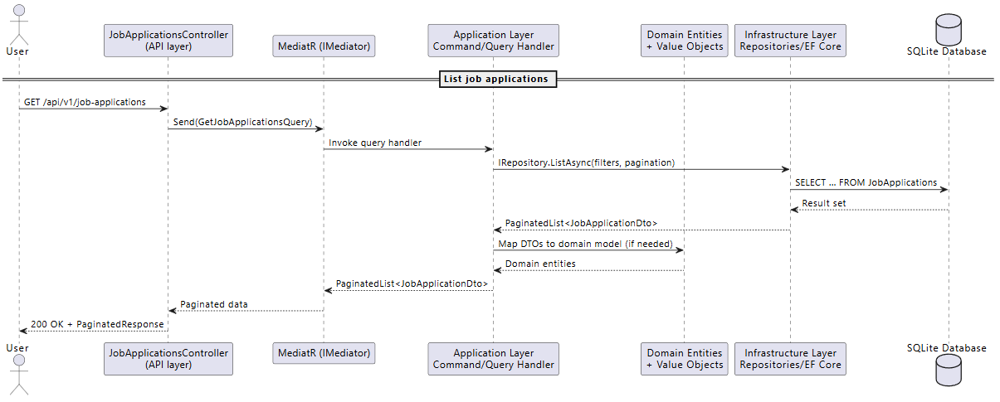
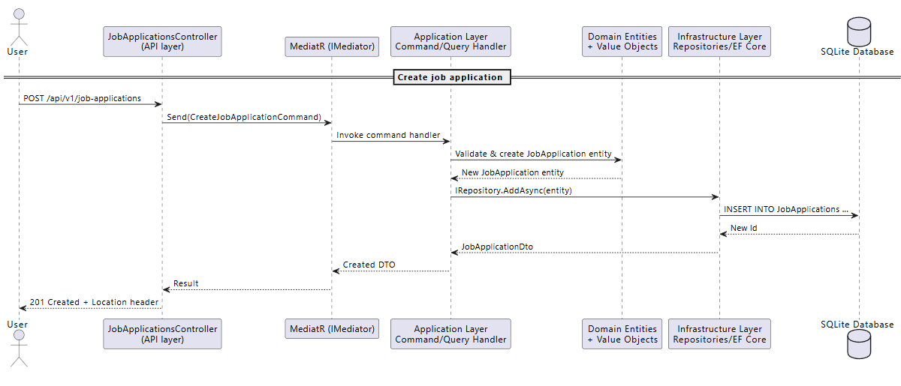
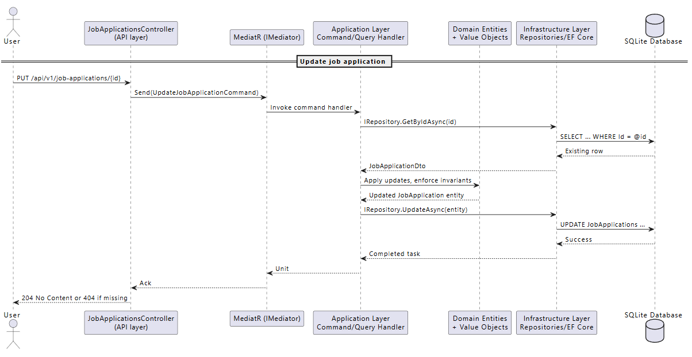
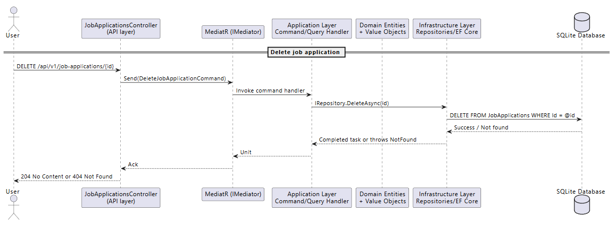

## Job Application Tracker API

Clean Architecture ASP.NET Core Web API hosted under `apps/api`.

### Projects

- `src/JobApplicationTracker.Api` – Presentation layer (controllers, contracts, middleware)
- `src/JobApplicationTracker.Application` – Application layer (CQRS handlers, validation)
- `src/JobApplicationTracker.Domain` – Domain entities and enums
- `src/JobApplicationTracker.Infrastructure` – EF Core persistence, repositories, logging
- `tests/*` – Unit and integration test projects mirroring the feature layout

### Endpoint Sequence Diagrams

- **List job applications**  
  The controller forwards `GET /api/v1/job-applications` to MediatR, which dispatches a query handler. The handler requests a paginated result from the repository, the infrastructure layer translates the request into SQL, and the resulting `PaginatedList<JobApplicationDto>` is returned to the client as a 200 response.  
  

- **Create job application**  
  A `POST /api/v1/job-applications` request is wrapped in a `CreateJobApplicationCommand` and sent via MediatR. The command handler validates and instantiates the domain entity, persists it through the repository/EF Core, and returns a DTO and location header with the new identifier.  
  

- **Update job application**  
  The controller issues `UpdateJobApplicationCommand` for `PUT /api/v1/job-applications/{id}`. The handler loads the existing entity, applies updates while enforcing invariants, then persists the change. A successful update yields a 204 response; missing records surface as 404.  
  

- **Delete job application**  
  A `DeleteJobApplicationCommand` handles `DELETE /api/v1/job-applications/{id}`. The handler delegates to the repository to remove the record and returns 204 on success, propagating not-found cases as 404 to the client.  
  

### Local Development

```bash
dotnet build JobApplicationTracker.sln
dotnet ef database update --project src/JobApplicationTracker.Infrastructure --startup-project src/JobApplicationTracker.Api
dotnet run --project src/JobApplicationTracker.Api
```

Swagger UI is available at `/swagger`. API routes remain versioned under `/api/v1/job-applications`.

### Testing

```bash
dotnet test JobApplicationTracker.sln
```

The solution includes layered test coverage under `tests/`:

- Application layer unit tests check validator rules and command handlers—for example ensuring `CreateJobApplicationCommandValidator` rejects invalid payloads and `UpdateJobApplicationCommandHandler` updates or throws when the record is missing.
- Infrastructure tests run against an in-memory SQLite database to validate `JobApplicationRepository` persistence, filtering, and pagination behavior.
- API integration tests spin up the web host via `ApiWebApplicationFactory` and exercise the full CRUD flow over HTTP, asserting responses and schema migrations.

### Docker

Build and run from the `apps/api` directory:

```bash
docker build -t job-application-tracker-api .
docker run --rm -p 8080:8080 job-application-tracker-api
```

The Dockerfile is colocated alongside this README.
